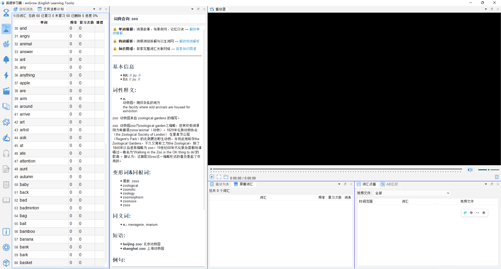
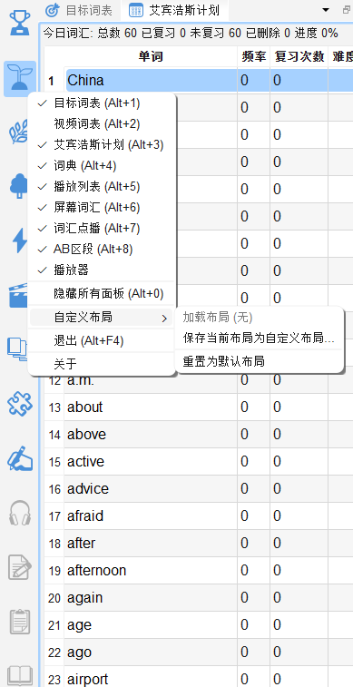
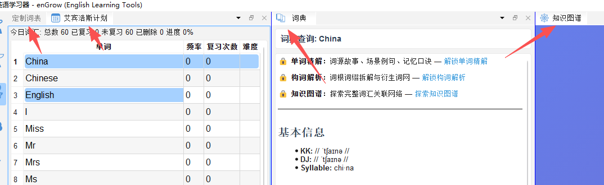

# 界面总览

## 2.1 主界面布局

enGrow 采用可分区停靠的多面板界面（Dock 布局），各功能面板可根据当前学习任务自动切换布局。

主界面分为以下几个功能区域：

| 区域             | 位置（默认布局）  | 说明                        |
| -------------- | --------- | ------------------------- |
| **工具栏**        | 顶部        | 模式切换、常用操作                 |
| **词汇区**（左侧）    | 左侧面板组     | 目标词表、视频词表、定制词表、艾宾浩斯复习、听写等 |
| **词典/精解区**（右上） | 右侧上方      | 词典查询、单词精解（BBW）            |
| **视频区**（右中）    | 右侧中部      | 视频播放窗口                    |
| **知识图谱**（右中）   | 与视频区共用标签组 | 词汇关联网络图谱                  |
| **播放列表区**（右下）  | 右侧下方      | 视频播放列表、字幕词汇、词汇点播、AB段落     |

---

## 2.2 工具栏模式切换

工具栏最重要的功能是**学习模式切换**。不同模式会调整界面布局，突出当前任务所需面板。

| 模式 | 图标 | 适用场景 |
|---|---|---|
| 目标词表 | 🎯 | 专注复习词表中的目标词汇 |
| 拓展词汇量 | 🕸️ | 通过知识图谱探索词汇关联 |
| 深入掌握 | 📢 | 配合单词精解深度理解单词 |
| 定制学习 | ⭐ | 自定义学习内容 |
| 娱乐模式 | 🎬 | 边看视频边轻松积累词汇 |
| 图书阅读 | 📚 | 精读英文图书 |
| 构词解析 | 🧩 | 学习词根词缀构词规律 |
| 听写 | ✍️ | 听写训练 |
| 听读 | 🎧 | 听读结合训练 |
| 成就 | 🏆 | 查看学习进度与成就 |

---

## 2.3 面板切换标签

词汇区（左侧）和右侧各功能区均以**标签页形式**组织多个面板，点击标签名可在面板之间切换。

---
