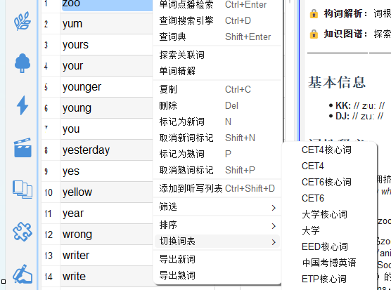
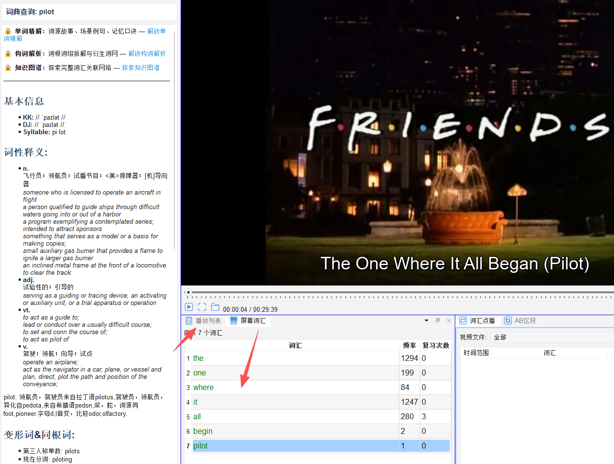
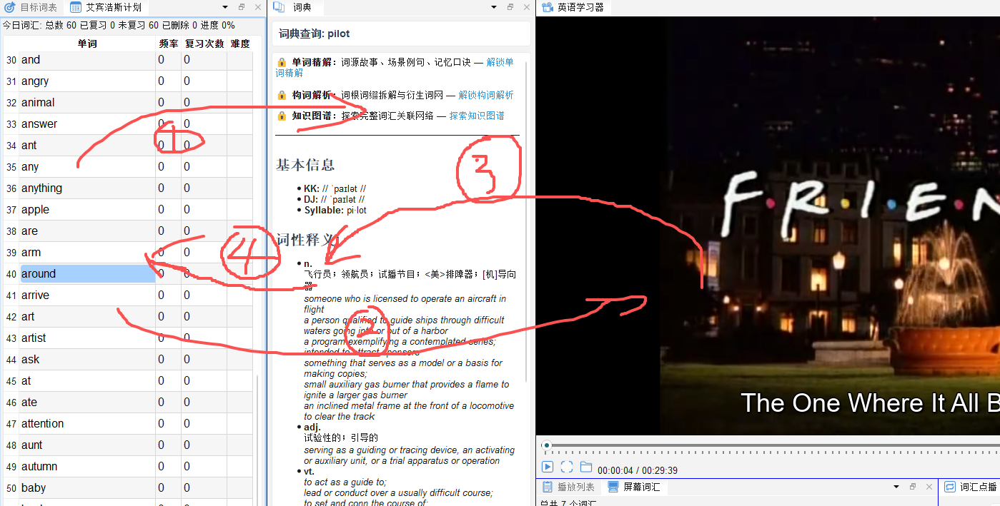

# 首次使用引导

## 3.1 选择目标词表

首次启动后，建议先设置您的学习目标词表。

1. 点击工具栏左侧的**设置（齿轮）图标**，或按 `Ctrl+,`
2. 在「词汇」选项卡中，选择适合自己备考目标的词表，例如：
   - **PS Syllabus**：高中/高考词汇
   - **大学英语四级**
   - **大学英语六级**
   - **考研英语**
   - **雅思词汇**
3. 点击「确定」保存，软件将加载对应词表



---

## 3.2 打开第一个视频

1. 点击工具栏的**打开文件图标** 📂，或按 `Ctrl+O`
2. 选择一个带有英文字幕的视频文件（支持 mp4、mkv、avi 等格式）
3. 视频加载后，字幕词汇会自动出现在底部右下角「屏幕词汇」面板

> 💡 **提示**：如视频没有内嵌字幕，可单独加载外挂 `.srt` 字幕文件：点击播放器下方的字幕按钮选择字幕文件。



---

## 3.3 查看第一个单词

1. 播放视频时，当字幕出现感兴趣的单词，按**空格键**暂停
2. 在右侧「字幕词汇」面板中点击该单词
3. 词典面板（右上方）自动显示该单词的释义


---

## 3.4 标记生词

查词后，可将该词标记为「生词」，加入学习列表：

- 在词汇列表中按 **N 键**：标记为生词（未掌握）
- 在词汇列表中按 **P 键**：标记为熟词（已掌握）

标记为生词的单词会进入**视频词表**，供后续集中复习。

---

## 3.5 推荐的日常学习流程
英语学习分为词汇, 语法, 阅读, 听力, 写作等内容, 其中词汇是基础, 重中之重. 词汇学习的过程需要经历三个阶段, 第一阶段, 基础夯实阶段; 第二阶段, 词汇量拓展阶段; 第三阶段, 深入掌握学习阶段.  针对不同的阶段 , 建议使用不同的学习工具, 以及采用不同的学习流程. 以基础夯实阶段为例, 建议使用"目标词汇学习"布局模式, 基于艾宾浩斯遗忘曲线制定的复习计划, 在艾宾浩斯计划面板内容扫光单词后, 进入听写. 
```
每日学习流程（建议 30–60 分钟）

① 艾宾浩斯复习结合视频学习（30–40分钟）
   ↓ 遇到生词 → 查词典 → 按N标记
   
② 听写（15分钟）
   → 打开「词汇点播」：循环播放生词所在视频片段，强化记忆
   
③ 拓展词汇（可选）
   → 打开「知识图谱」：探索生词的词汇关联网络，举一反三

④ 精解（可选）
   → 打开「复习」面板：完成今日到期的遗忘曲线复习标志

```


