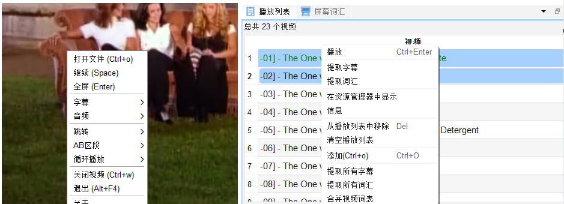
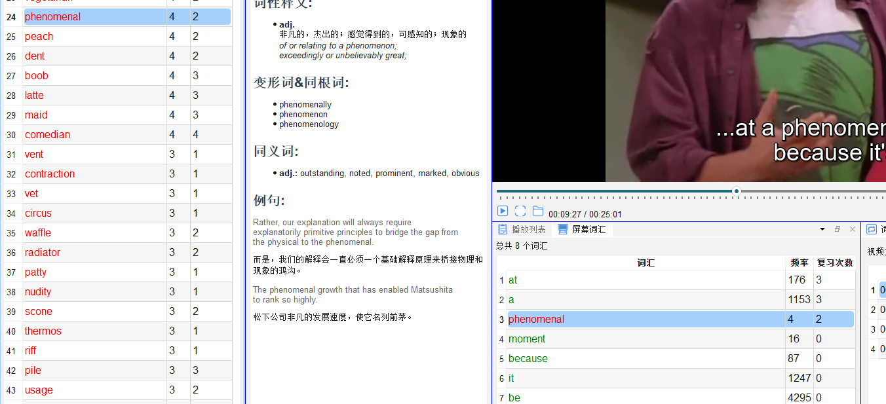

# 打开视频与字幕

## 4.1 打开视频文件

**方法一：工具栏按钮**
1. 点击工具栏的 📂 **打开文件**图标
2. 在文件选择对话框中，选择视频文件
3. 点击「打开」，视频自动加载并开始播放

**方法二：直接拖拽**
- 将视频文件从文件资源管理器拖入播放器窗口

**方法三：播放列表**
- 在「播放列表」面板中点击「+」添加文件或整个文件夹

---

## 4.2 支持的视频格式

软件使用 VLC 内核播放，支持市面上主流视频格式：

| 格式 | 说明 |
|---|---|
| MP4、MKV | 最常见，推荐使用 |
| AVI、MOV | 支持 |
| FLV、WMV | 支持 |
| 其他 VLC 支持的格式 | 均可使用 |

---

## 4.3 字幕加载

### 4.3.1 自动加载字幕

满足以下条件时，字幕会自动加载：

- **内嵌字幕**：MKV 等容器内嵌字幕流
- **同名外挂字幕**：与视频文件同目录且同文件名（如 `video.mp4` 对应 `video.srt`）

### 4.3.2 手动加载外挂字幕

1. 下载字幕文件 `.srt`、`.ass`、`.ssa` 等字幕文件
2. 修改字幕文件名称, 格式: 视频文件名称 + 语言 + 后缀
3. 重新打开视频

### 4.3.3 屏幕词汇面板

成功加载字幕后，每条字幕出现时，其中的英文单词会自动提取并显示在**屏幕词汇面板**（`🖥️ 字幕词汇`）中。

面板中单词按「是否已标记」分色显示：
- **白色**：未见过 / 未标记
- **绿色**：已标记为熟词
- **橙色 / 红色**：已标记为生词

---

## 4.4 批量添加视频

1. 打开「播放列表」面板（`📋 播放列表`）
2. 点击「添加文件夹」按钮
3. 选择包含多个视频的文件夹中的若干个文件
4. 软件自动扫描并将视频添加到播放列表

