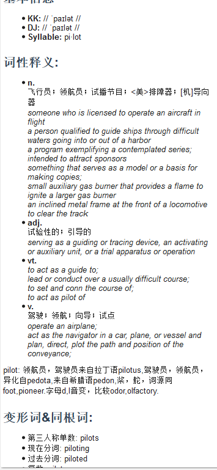
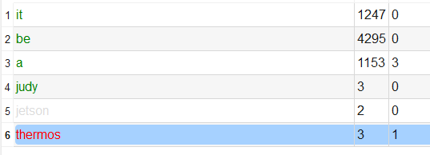

# 边看视频边查词

## 6.1 工作原理

enGrow 的核心学习场景是：**通过英文视频有意义的图形化场景，结合有意识的重复学习, 达成词汇的听说记**。

字幕中出现的每个英文单词都会实时显示在**屏幕词汇面板**，同时标注该词在目标词表中的掌握状态，帮助您快速识别哪些词需要关注。

---

## 6.2 查词流程

### 方法一：点击屏幕词汇面板

1. 视频播放时，当前字幕的单词自动列在「字幕词汇」面板
2. 点击任意单词 → 右上方**词典面板**立即显示该词的释义、例句等信息
3. 鼠标移动到某面板上， 则焦点将很快切换到该面板上. 
4. 然后即可使用面板的各种快捷键.

### 方法二：手动搜索

1. 在词典面板顶部搜索框中输入单词
2. 在任意词表面板中按下 Ctrl + 回车键查询
3. 在任意词表面板中右键或者使用快捷键 Ctrl + D 使用第三方单词搜索引擎网站进程查询. 这行操作适用于少量单词词典中查找不到的情况下, 所以一种兜底的查询方式. 

---

## 6.3 词典面板信息说明

词典面板显示内容（依数据包版本有所差异）：

| 区域 | 说明 |
|---|---|
| 单词与音标 | 单词原形及国际音标 |
| 词义列表 | 按词性分类的中文释义 |
| 例句 | 真实语境例句（英文 + 中文翻译）|
| 词频/词汇分级 | 该词在目标词表中的级别 |
| 相关词 | 同义词、反义词等（高级数据包）|

---

## 6.4 标记生词与熟词

查词后，对目标词汇进行标记，是积累词汇的关键步骤：

| 快捷键 | 操作 | 说明 |
|---|---|---|
| `N` | 标记为生词 | 加入「视频词表」列表，待复习 |
| `P` | 标记为熟词 | 标记为已掌握，统计学习进度 |

> 在词汇列表（字幕词汇、视频词表、目标词表）中选中单词后按相应键即可。一次可以标注多个单词. 

---

## 6.5 查看单词在视频中的出现位置

在「视频词表」面板中，每个单词条目显示其**在当前视频出现的次数**。

双击单词或按回车键：视频自动跳转到该单词第一次出现的字幕时间点并播放。

---

## 6.6 推荐观看姿势

1. **第一遍**：正常速度观看，遇到不熟悉的词按空格暂停 → 查词 → 按 N 标记 → 继续
2. **第二遍**：速度调至 0.75×，重点关注生词所在句子的语境
3. **第三遍**（可选）：打开「词汇点播」，集中循环播放生词出现的片段
