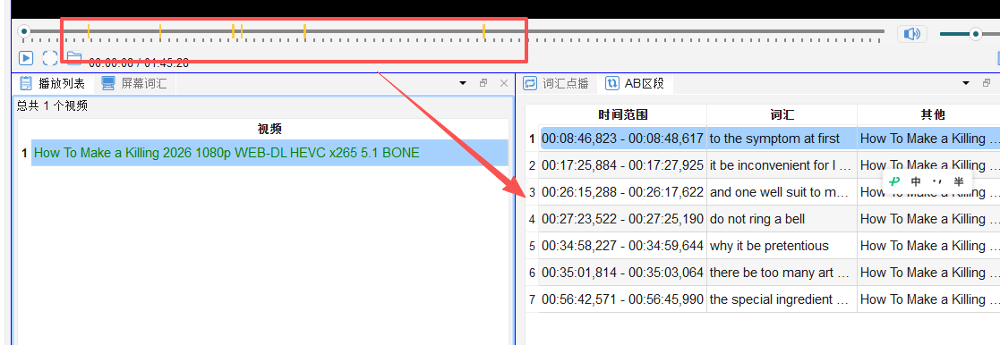

# AB 段落循环精听

## 7.1 什么是 AB 段落循环

AB 段落循环（AB Segment Loop）允许您**精确设定视频的起始点（A）和终止点（B）**，让播放器在这段区间内无限循环播放，适合：

- 精听难以听清的句子或段落
- 反复跟读以模仿发音
- 集中攻克某一句话中的词汇

---

## 7.2 设置 AB 段落


### 方法一：快捷键（推荐）

快捷键的设计方法: 

| 快捷键   | 操作                    |
| ----- | --------------------- |
| `[`   | 设置当前播放位置为 **A 点**（起始） |
| `]`   | 设置当前播放位置为 **B 点**（终止） |
| Ctrl  | 左移(向前/小时间方向移动)        |
| Alt   | 右移(向后/大时间方向移动)        |
| shift | 取消                    |

设置完 A、B 两点后，播放器自动开始在该区间循环。基于以上设计方法, 可以推导出一系列对 AB区段的设计, 取消, 移动快捷键和操作方法. 

### 方法二：AB 段落面板手动输入

1. 打开「AB 段落」面板（`🔃 AB 段落`）
2. 在 A 点输入框填入起始时间（格式：`mm:ss.xxx`）
3. 在 B 点输入框填入终止时间
4. 点击「开始循环」

---

## 7.3 管理已保存的 AB 段落

常用的 AB 段落可以保存下来，方便下次继续练习：

1. 在 AB 段落面板中点击「保存当前段落」
2. 为该段落命名（可选），如「第5集-第3幕重要对话」
3. 已保存段落列表显示在面板下方

---

## 7.4 循环次数设置

可设定循环播放的次数（默认：无限循环）：

1. 在 AB 段落面板中找到「循环次数」选项
2. 输入想要循环的次数（如填 `5` 则循环 5 次后自动停止）
3. 填 `0` 表示无限循环

---

## 7.5 精听技巧建议

```
精听四步法：
① 盲听    — 不看字幕，听清多少算多少
② 对照字幕 — 打开字幕，找出没听清的词
③ 查词    — 对生词查词典，理解意思
④ 跟读    — 模仿语音、语调，跟读 3-5 遍
```

AB 循环配合这四步法，每次专注一个 5–10 秒的片段，效果最佳。
