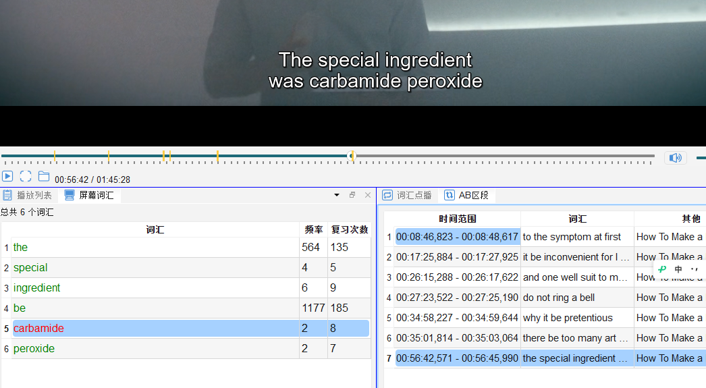
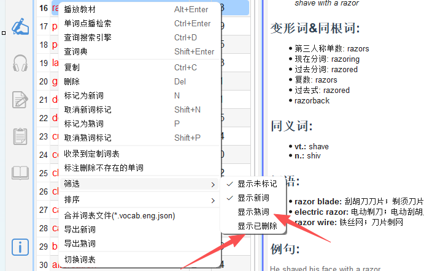

# 字幕词汇捕获

## 8.1 功能说明

**字幕词汇捕获**（屏幕词汇面板）是指：视频播放时，当前字幕句中的所有英文单词被**自动提取、分词并展示**，每个词显示其在目标词表中的掌握状态。

此功能让您无需暂停就能快速浏览当前句的词汇，并即时标记生词。

---

## 8.2 面板说明

屏幕词汇面板（`🖥️ 字幕词汇`）显示内容：

- **当前字幕句的所有单词**（自动分词，去除标点）
- **颜色标注**：
  - 🟩 绿色：目标词表中的熟词（已标记为掌握）
  - 🟥 橙/红色：目标词表中的生词（未掌握）
  - ⬜ 白/灰色：不在目标词表中 / 未标记
- **词频指示**：单词在当前视频中出现的次数（高频词显示较突出）

---

## 8.3 操作

### 查词
- **单击**屏幕词汇面板中的任意单词 → 右侧词典面板显示释义

### 标记
选中屏幕词汇面板中的单词后：
- 按 `N` → 标记为生词（加入视频词表）
- 按 `P` → 标记为熟词

### 跳转
- **双击**面板中的单词 → 视频跳转到该词所在字幕的时间点

---

## 8.4 历史字幕词汇

屏幕词汇面板默认只显示**当前字幕**的词汇。切换到「视频词表」面板（`🎬 视频词表`）可通过筛选词汇的状态(未标记/生词/熟词/已删除)查看本次观看过程中累积标记的所有生词。也可以通过排序规则来对不同特征的词汇进行有序的学习. 

---

## 8.5 批量操作技巧

观看完一集视频后，可在「视频词表」面板中批量处理：

1. 按 `Ctrl+A` 全选所有生词
2. 按 `P` 批量标记为熟词（如果你认为大部分都会了）
3. 或逐个点击重新确认不熟悉的词，保留为生词

生词列表中的词会自动进入**艾宾浩斯复习计划**，按科学的遗忘曲线安排后续复习。
