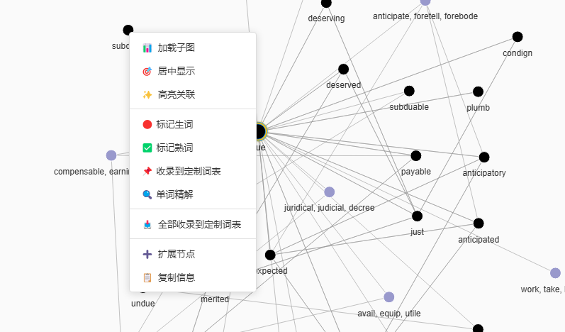
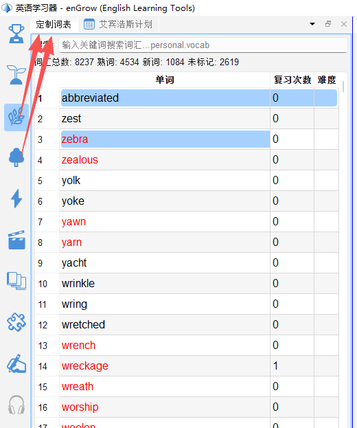
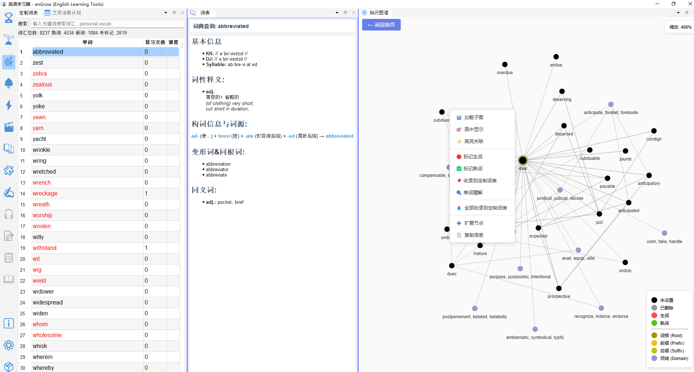
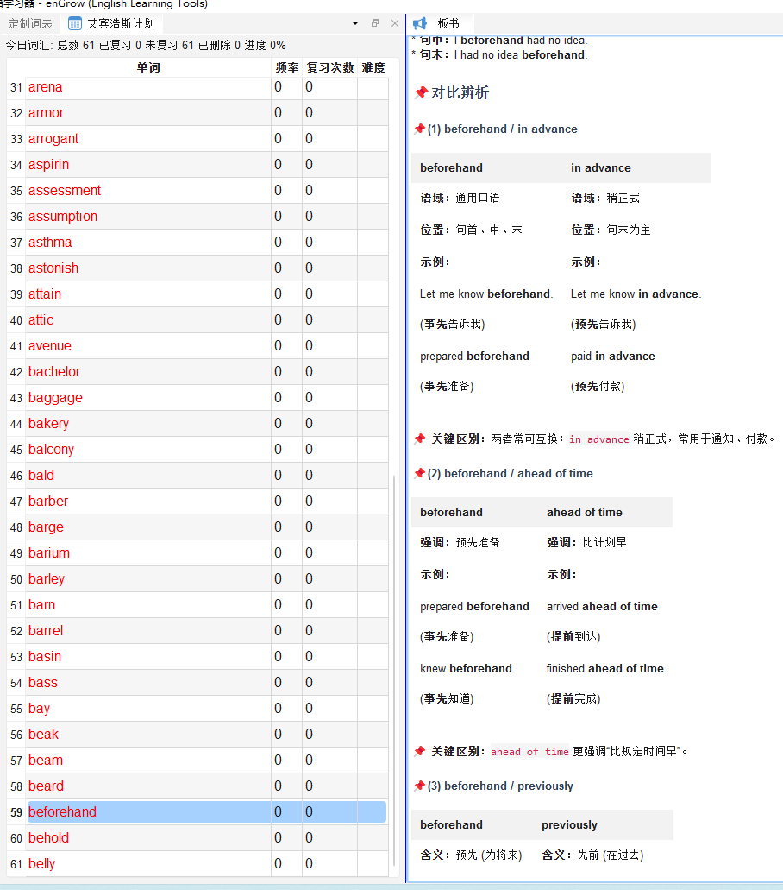

# 定制词表

## 11.1 什么是定制词表

**定制词表**（`⭐ 定制词表`）是您自己创建和维护的个性化单词列表。  
与目标词表（系统预设）不同，定制词表完全由您决定包含哪些词汇，适合：

- 收录在视频、阅读材料中反复遇到的高频词
- 整理某个专题的词汇（如科技词汇、医学词汇）
- 从知识图谱中批量收录相关词汇
- 记录需要重点攻克的词汇

---

## 11.2 添加单词到定制词表

### 方法一：从词汇面板收录

在任意词汇面板（视频词表、字幕词汇）中：
1. 选中单词（可多选：按住 Ctrl 点击）
2. 右键菜单 → **收录到定制词表**
3. 或直接按快捷键 `C`（收录）

### 方法二：从知识图谱批量收录

在知识图谱中，可一键收录某个词的关联词汇群：
1. 在知识图谱中右键点击某个词节点
2. 选择「全部收录到定制词表」
3. 所有关联词汇（可见节点）将批量添加到定制词表

### 方法三：手动输入

1. 在定制词表面板顶部的输入框中，输入单词
2. 按 Enter 添加

---

## 11.3 定制词表面板操作

| 快捷键 | 操作 |
|---|---|
| `N` | 标记为生词（重点复习）|
| `P` | 标记为熟词（已掌握）|
| `Delete` | 从定制词表中删除 |
| `Enter` / 单击 | 查词典 |
| `Ctrl+F` | 搜索单词 |

---

## 11.4 定制学习模式

切换工具栏到**定制学习模式**（⭐），界面专为定制词表学习优化：

- 左侧：定制词表（默认筛选生词）
- 右侧上方：词典 / 单词精解
- 右侧下方：知识图谱（展示选中词的关联网络）

---

## 11.5 深入阶段学习模式

切换工具栏到**深入阶段学习模式**（📢），界面结合定制词表和单词精解（BBW）：

- 左侧：定制词表
- 右侧：单词精解面板（BBW，显示选中词的深度解析内容）

> 💡 深入阶段学习模式需要解锁**单词精解数据包（BBW）**。

---

## 11.6 导出定制词表

1. 在定制词表面板右键菜单中，选择「导出词表」
2. 支持导出为纯文本（每行一个单词）或 CSV 格式
