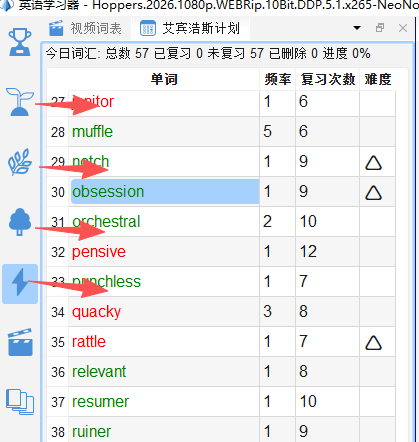
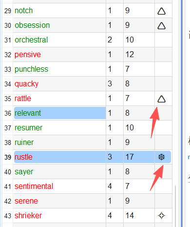
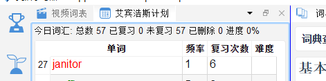

# 遗忘曲线复习（艾宾浩斯）

## 13.1 为什么需要遗忘曲线复习

根据艾宾浩斯遗忘曲线研究，记忆一个新词后：
- **1天后**：记忆率降至约 55%
- **3天后**：降至约 40%
- **7天后**：降至约 25%

enGrow 的**艾宾浩斯复习**功能根据您的标记记录，**自动计算每个词的最佳复习时机**，确保在遗忘前完成复习，大幅提升记忆效率。

---

## 13.2 进入学习计划

1. 点击工具栏切换到多个模式都能看到「艾宾浩斯计划」面板. 因为基于艾宾浩斯遗忘曲线组织学习是软件的重要理论基础. 学习计划包含的内容包括生词和熟词. 如果想让熟词不加入学习计划, 需要在开始学习计划之前先标注生词和熟词. 这个过程第一次标志也很快, 虽然有些乏味, 但是对后面的学习质量和效率有帮助, 值得去做. 

当有到期待复习词汇时，面板会显示今日待复习数量（如 `今日待复习：23 词`）。

---

## 13.3 复习流程

**流程**: 
1. 打开艾宾浩斯面板
2. 先扫描一遍单词, 快速温习将熟词标志为已复习(Ctrl+F)
3. 选中所有剩余单词, Ctrl + L, 增加标记
4. 从第一个单词开始, 逐个学习
5. 看单词, 头脑中复现单词要点; 如果熟练复现, 如果存在标志, 则降低标志(Ctrl+H), 没有标志时标注单词为已复习(Ctrl+F)
6. 不能熟练复现, 则点播学习(快捷键, 1-9 默认点播第一次出现的视频片段)
7. 点播之后，评价识别程度, Ctrl + L 增加标志, Ctrl+H 减少标志
8. 进行下一个单词的学习， 直到艾宾浩斯计划内容学习一遍词表
9. 如果计划没有情况, 重复循环4-9步骤, 直到计划清空

**要点**: 
1. 去熟词后, 批量增加标志
2. 建议清空标志后标注为已复习; 不建议在有标志情况下直接标注为已复习
3. 强烈建议频繁使用视频点播播放片段,增加语境刺激 1-9 快捷键
4. 通过多遍学习直到清空词表

| 按键            | 评分   | 说明             |
| ------------- | ---- | -------------- |
| `N`           | 加入生词 |                |
| `P`           | 加入熟词 |                |
| , 或 Ctrl + H  | 减小标志 | 适用于头脑中能够召唤单词信息 |
| . 或者 Ctrl + L | 加大标志 | 不熟悉; 想不起来      |
也就是说, 生词的一次学习过程中, 经历多遍的学习, 每次不能记忆都增加一次标志, 每次能够记忆起来就减少一次标记, 随着标记数量的变化, 生词自然增加了学习次数;熟词使用了很少的学习次数. 

---

## 13.4 复习间隔说明

| 复习阶段    | 间隔天数  | 累计天数   |
| ------- | ----- | ------ |
| 第 1 次复习 | 1 天后  | 第 2 天  |
| 第 2 次复习 | 2 天后  | 第 4 天  |
| 第 3 次复习 | 4 天后  | 第 8 天  |
| 第 4 次复习 | 7 天后  | 第 15 天 |
| 第 5 次复习 | 15 天后 | 第 30 天 |
| 长期记忆    | 30 天后 | —      |

连续 5 次标记「记住了」的单词将升级为**长期记忆**词汇，将会自动规划复习周期; 注意新标注的熟词也会被纳入到复习的计划中。

---

## 13.5 复习进度统计

面板顶部显示：
- **今日已复习**：已完成的卡片数
- **今日剩余**：还有多少词待复习

---

## 13.6 提高复习效率的建议

- 每天固定时间复习（如早饭后或睡前），养成习惯
- 优先完成「今日到期」的词，不要拖到第二天
- 复习时遮住释义，真实测试自己的记忆
- 结合「词汇点播」：对「没记住」的词，立即在视频中看它的语境
