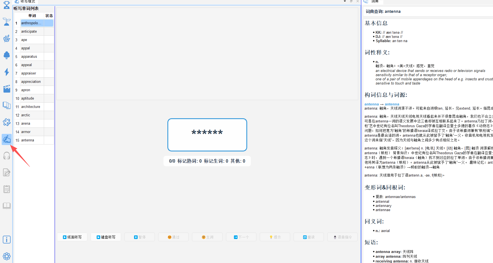
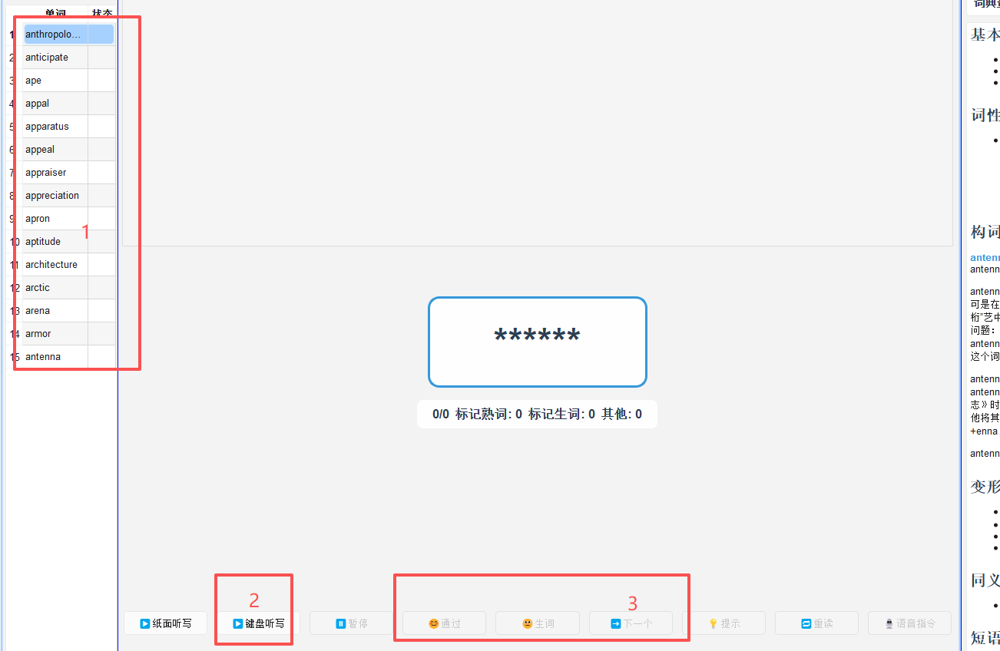
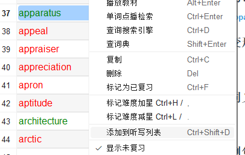

# 听写训练

## 14.1 功能说明

**听写训练**（`✍️ 听写`）通过播放音频让您拼写听到的单词或句子，是检验和强化词汇掌握的高效方式。

---

## 14.2 进入听写模式

1. 点击工具栏的 ✍️ **听写**图标，切换到听写模式
2. 或直接打开「听写」面板（`✍️ 听写`）

---

## 14.3 听写流程

1. 从各个词表添加要听写的单词到听写列表
2. 点击开始听写
3. 在输入框中**拼写**听到的单词
4. 按 `Enter` 提交答案
5. 软件立即反馈：
   - ✅ 正确：单词高亮绿色，自动进入下一词
   - ❌ 错误：显示正确拼写，可按 `R` 重新收听，再次尝试

---

## 14.4 听写来源选择

可以选择从以下来源进行听写：

| 来源      | 说明             |
| ------- | -------------- |
| 目标词表生词  | 当前词表中未掌握的词（默认） |
| 艾宾浩斯今日词 | 今天到期的复习词汇      |
| 定制词表    | 您自定义收录的词汇      |
| 视频词表    | 本次观看标记的生词      |

在听写面板顶部下拉菜单中切换来源。

---

## 14.5 听写设置

| 设置项 | 说明 |
|---|---|
| 播放速度 | 调整发音速度（慢速 0.75× 适合初学）|
| 重播次数 | 每词自动播放几遍（默认 1 次）|
| 区分大小写 | 开启后严格匹配大小写（默认关闭）|
| 句子听写 | 开启后以字幕句子为单位听写（需要视频字幕）|

---

## 14.7 快捷键

| 快捷键                        | 操作     |
| -------------------------- | ------ |
| `Enter`                    | 提交答案   |
| ctrl + enter               | 强制提交   |
| Alt+J    (paper)           | 面听写开始  |
| Alt+K (keyboard)           | 键盘听写开始 |
| Alt+S (suspend/resume)     | 暂停/继续  |
| Alt+P (pass)               | 通过     |
| Alt+N  (new word)          | 生词     |
| Alt+L (next)               | 下一个    |
| Alt + H (hits)             | 提示     |
| Alt + R (read repeat)      | 再读     |
| Alt + T (dictation repeat) | 生错词听写  |
| Alt + V  (enable voice)    | 启用语音指令 |
