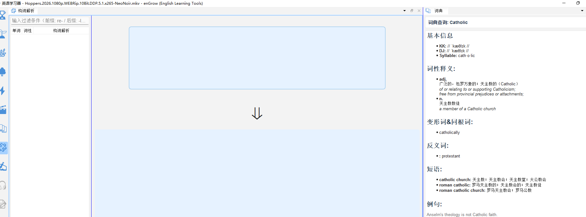
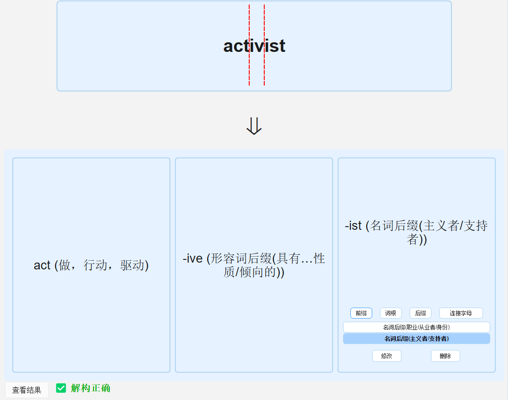
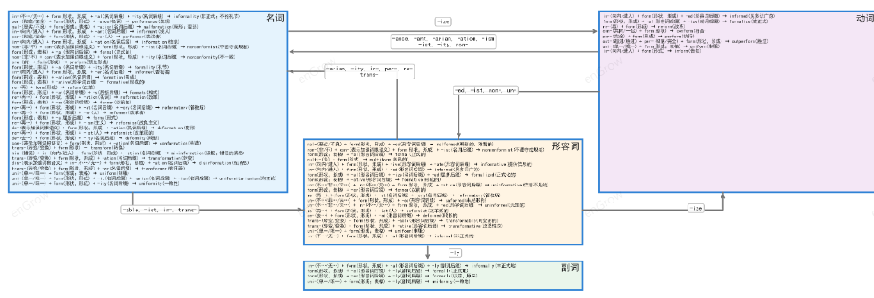
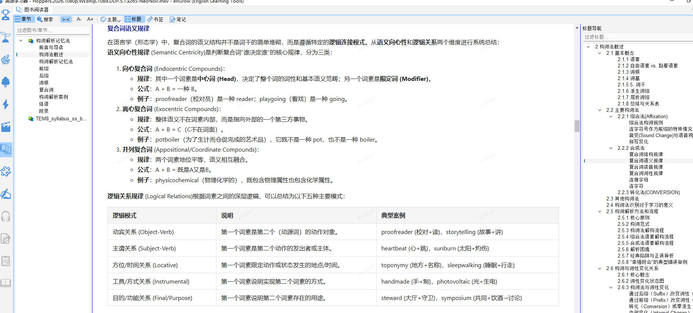

# 构词解析

> 🔒 本功能需要解锁**构词解析数据包（WF）**。试用版不包含此功能。

## 15.1 功能说明

**构词解析**（`🧩 构词解析`）通过拆解单词的**词根（root）、前缀（prefix）、后缀（suffix）**，帮助您理解单词的构造逻辑，用联想法快速记住单词。

例如：
```
uncomfortable
  un-  （否定前缀）
  comfort（词根：舒适）
  -able （后缀：能够…的）
→ 不舒适的
```

掌握词根词缀后，见到陌生词汇可以通过拆解猜出大意，词汇量呈指数级增长。

---

## 15.2 进入构词解析模式

1. 点击工具栏的 🧩 **构词解析**图标
2. 界面自动调整为「词根词缀学习」布局



或者, 每日完成基本学习计划后,  点击下面按钮进入构词解析练习. 
![[attachments/Pasted image 20260607021326.png]]

---

## 15.3 查看单词构词解析

在任意词汇面板中点击一个单词后，**构词解析面板**自动显示该词的拆解内容：



面板内容包括：

| 区域 | 内容 |
|---|---|
| 词形拆解 | 用颜色区分前缀、词根、后缀 |
| 各部分含义 | 每个词素的中文含义 |
| 同根词列表 | 含有相同词根的其他单词 |
| 记忆联想 | 基于构词逻辑的记忆口诀（部分词汇）|

---

## 15.4 词根专项学习

除按单词查看外，还可按**词根**系统学习：

1. 在构词解析面板的「词根列表」中选择一个词根（如 `port`：携带、运输）
2. 面板展示该词根的所有派生词：`import`、`export`、`transport`、`support`、`report`...
3. 每个派生词均可点击查词典



---

## 15.5 <构词解析记忆法>图书

点击构词解析面板底部的「📖 阅读/解锁『构词解析记忆法』」链接，可打开配套的电子图书。

该图书系统介绍：
- 最高频的 200+ 个词根词缀
- 各词根解读和学习阶段的所有对应单词


