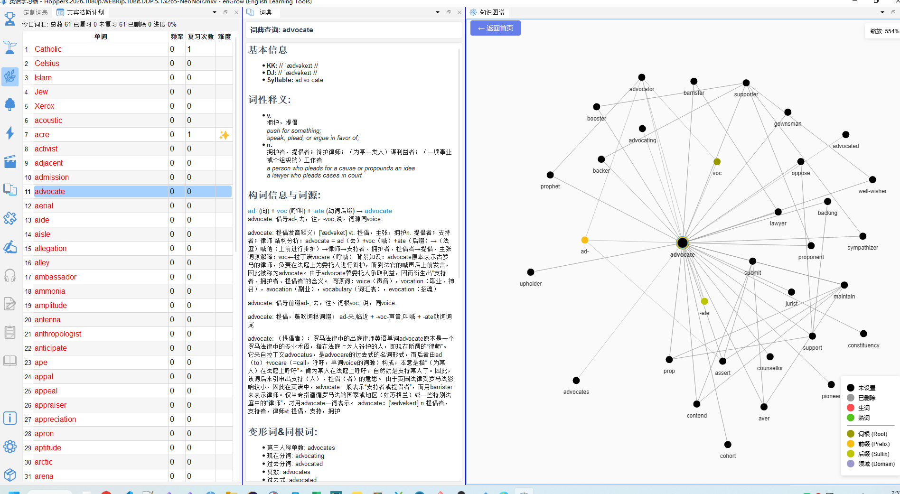
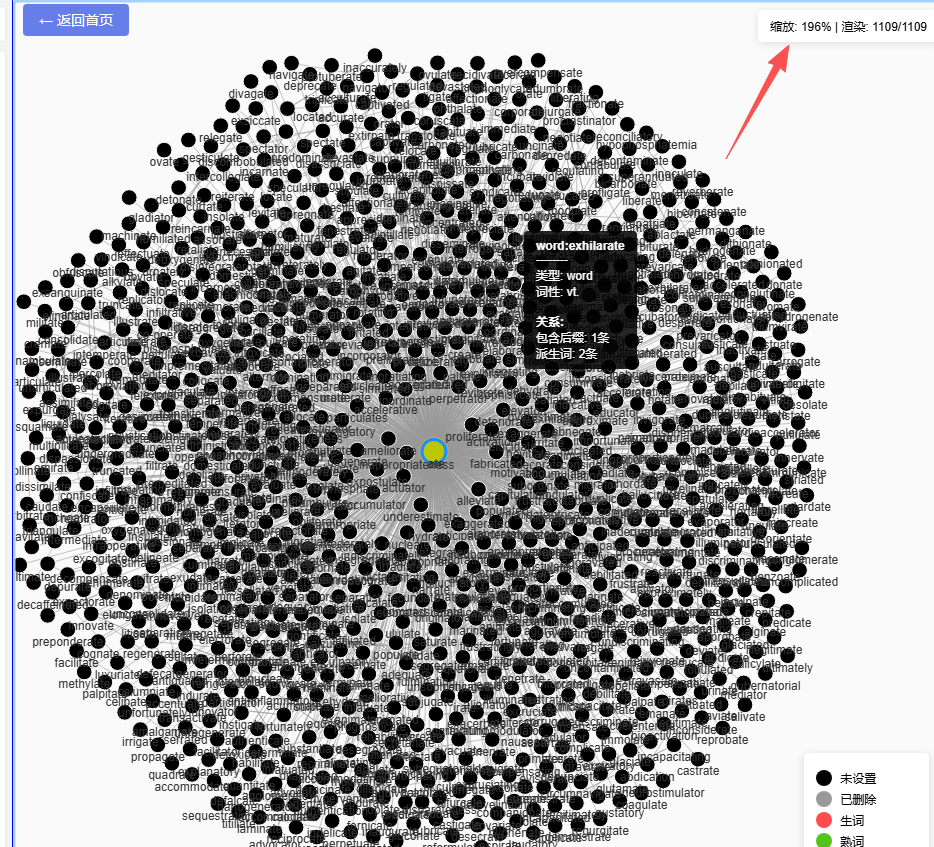
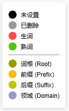

# 知识图谱

> 🔒 本功能需要解锁**知识图谱数据包（KG）**。试用版提供有限节点演示。

## 16.1 功能说明

**知识图谱**（`🕸️ 知识图谱`）将词汇之间的关联关系以**可交互的网络图**形式呈现，帮助您：

- 发现一个词的**语义邻居**（意思相关的词）
- 找到该词的**同根词**（词形相关）
- 了解词汇在语言体系中的位置
- 以词汇群为单位系统拓展词汇量

---

## 16.2 打开知识图谱

1. 点击工具栏的 🕸️ **拓展词汇量**图标
2. 或直接点击「知识图谱」面板标签
3. 在词汇列表中点击任意单词 → 知识图谱自动导航到该词的子图

---

## 16.3 图谱交互操作

| 操作 | 效果 |
|---|---|
| **滚轮缩放** | 放大/缩小图谱视野 |
| **拖拽画布** | 移动查看图谱不同区域 |
| **点击节点** | 选中该词，右侧词典面板同步显示释义 |
| **双击节点** | 以该词为中心展开新的子图 |
| **右键节点** | 弹出上下文菜单（见下方）|

### 节点右键菜单

| 菜单项 | 说明 |
|---|---|
| 标记为生词（N）| 将该词标记为生词 |
| 标记为熟词（P）| 将该词标记为熟词 |
| 收录到定制词表 | 添加到定制词表 |
| 单词精解 | 切换到精解面板查看深度内容 |
| 全部收录 | 将当前可见的所有关联词一键收录 |

---

## 16.4 节点颜色说明

图谱中的节点颜色表示该词的掌握状态：

---

## 16.5 探索词汇关联的策略

### 扩散学习法

从一个不熟悉的词出发，向外探索：

1. 在目标词表中选中一个生词（如 `ambiguous`）
2. 知识图谱显示其关联词（如 `ambiguity`、`vague`、`obscure`...）
3. 对周边节点按颜色筛选：绿色节点是已会的词，帮助记忆；灰色/红色节点是需要学的词
4. 选择 2–3 个看起来有用的关联词，加入定制词表，下次重点学习

### 词汇群收录

1. 双击图谱中的关键词根词（如 `dict`：说话/命令相关词群）
2. 查看周边的同根词（`dictate`、`dictator`、`diction`、`predict`、`contradict`...）
3. 点击「全部收录」→ 所有节点添加到定制词表
4. 切换到定制词表，集中学习这一词汇群

---

## 16.6 快捷键（图谱内）

| 快捷键 | 操作 |
|---|---|
| `N` | 对选中节点标记为生词 |
| `P` | 对选中节点标记为熟词 |
| 滚轮 | 图谱缩放 |
