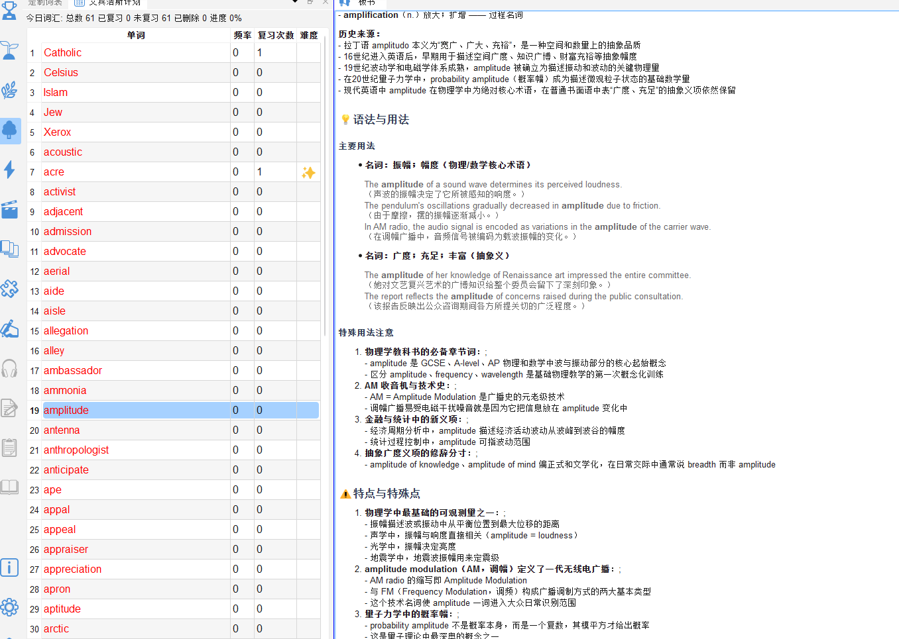
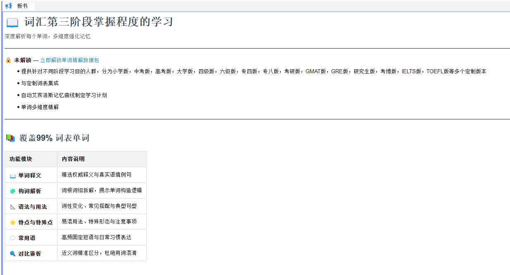

# 单词精解（BBW）

> 🔒 本功能需要解锁**单词精解数据包（BBW）**。

## 17.1 功能说明

**单词精解**（`📢 单词精解` / BBW — BlackBoard Words）提供每个单词的**深度解析内容**，远超普通词典的信息量，帮助您从多维度真正理解并记住单词。

---

## 17.2 精解内容一览

对每个词，精解面板提供：

| 内容模块 | 说明 |
|---|---|
| 📖 **单词释义** | 精选权威释义与真实语境例句 |
| 🧩 **构词解析** | 词根词缀拆解，揭示构词逻辑 |
| 📐 **语法与用法** | 词性变化、常见搭配与典型句型 |
| ⭐ **特点与特殊点** | 易混用法、特殊形态与注意事项 |
| 💬 **常用语** | 高频固定短语与日常习惯表达 |
| 🔍 **对比辨析** | 近义词精准区分，杜绝用词混淆 |

---

## 17.3 查看单词精解

### 方法一：深入阶段学习模式

1. 点击工具栏的 📢 **深入掌握**图标
2. 在左侧定制词表或目标词表中点击单词
3. 右侧精解面板自动显示该词内容

### 方法二：从词典面板跳转

在词典面板查词时，点击右上角「精解」按钮，跳转到精解面板。

---

## 17.4 精解面板操作

- **滚动**：上下滚动查看完整内容
- **链接跳转**：精解内容中可能包含指向相关词汇的链接，点击可查看该词精解
- **📖 阅读构词解析记忆法**：底部链接，打开配套图书详细介绍构词规律

---

## 17.5 与其他功能联动

| 联动功能 | 说明 |
|---|---|
| 知识图谱 | 在图谱中右键单词 → 「单词精解」 → 自动切换到精解面板 |
| 定制词表 | 在深入阶段学习模式下，选中定制词表的词自动显示精解 |
| 词典面板 | 词典查词后可跳转到精解 |

---

## 17.6 未解锁状态

未购买精解数据包时，精解面板显示**起始引导页**，介绍精解功能的内容和购买方式。

点击「立即解锁单词精解数据包」→ 弹出购买对话框。

