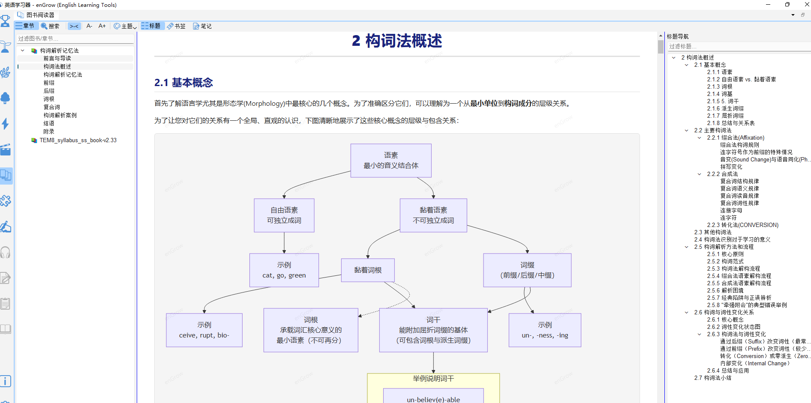

# 图书阅读器

> 📚 本功能提供内置英文图书的阅读能力，部分图书需单独购买。

## 18.1 功能说明

**图书阅读器**（`📚 图书阅读器`）内嵌于 enGrow，支持阅读英文 Markdown 格式图书，并与词典、单词精解等功能深度整合：

- 阅读时遇到生词，可即时查词典
- 阅读进度自动保存
- 图书内容与词汇学习数据关联

---

## 18.2 打开图书阅读器

1. 点击工具栏的 📚 **图书阅读**图标
2. 或打开「图书阅读器」面板

---

## 18.3 已内置图书

软件预置以下图书（视数据包情况）：

| 图书 | 说明 | 是否免费 |
|---|---|---|
| 构词解析记忆法 | 系统介绍词根词缀记忆方法 | 购买 WF 数据包附赠 |
| 其他英语学习参考书 | 待扩充 | — |

---

## 18.4 阅读操作

| 操作 | 说明 |
|---|---|
| 点击单词 | 词典面板即时显示释义 |
| 目录导航 | 左侧目录树，点击章节跳转 |
| 进度记忆 | 关闭后再次打开，自动跳到上次阅读位置 |
| 字体大小 | 可在设置中调整阅读字号 |

---

## 18.5 与构词解析联动

阅读「构词解析记忆法」图书时，内容中提到的词根词缀词汇可直接链接到构词解析面板，实现「读到 → 看拆解 → 看同根词」的完整学习闭环。
