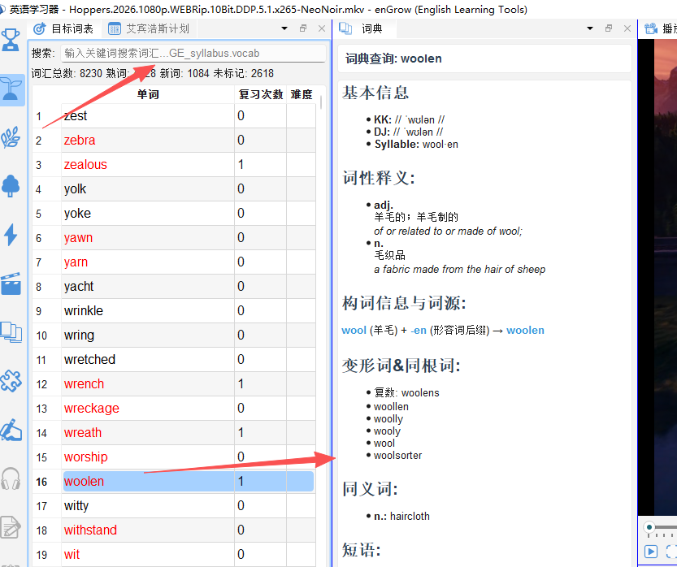

# 查词典

## 19.1 词典面板说明

**词典面板**（`📚 词典`）是 enGrow 的核心查词工具，与所有其他面板深度集成——无论在哪里点击单词，词典面板都会自动更新显示该词信息。

---

## 19.2 主动查词

1. 在词典面板顶部的**搜索框**中输入单词或词组
2. 按 `Ctrl+Enter` 查询

---

## 19.3 词典信息结构

| 信息区域   | 内容                    |
| ------ | --------------------- |
| 单词标题   | 原形、音标、词性标注            |
| 释义列表   | 按词性分类，每个义项配例句         |
| 变形词    | 在目标词表中的等级（如 CET-4 高频） |
| 同根词    | 当前标记（生词/熟词/未标记）及快速切换  |
| 短语&例句  | 常用短语; 释义例句;           |
| 相关功能链接 | 跳转到构词解析、单词精解、知识图谱     |

---

## 19.4 发音功能

鼓励使用影音资源中的场景化声音加强语言, 语调, 语气环境的学习, 建议频繁使用区段播放的功能进行发音学习. 

---

## 19.5 词典版本说明

enGrow 配套的词典经过专门针对英语学习场景的优化：

- **基础词典**（所有版本包含）：核心释义、音标、例句
- **高级词典数据包**（付费）：更丰富的例句、用法说明、辨析内容

当前加载的词典版本显示在词典面板右下角。

---

## 19.6 快捷键

| 快捷键 | 操作 |
|---|---|
| `Ctrl+F` / `Ctrl+D` | 聚焦词典搜索框 |
| `Enter` | 执行查词 |
| `Esc` | 清空搜索框 |
| `Alt+P` | 播放当前词发音 |
