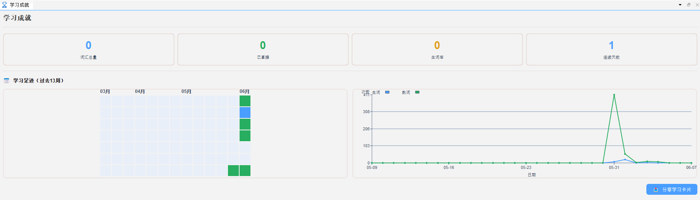

# 学习成就面板

## 20.1 功能说明

**学习成就面板**（`🏆 成就`）展示您的学习进度、积累数据和学习里程碑，帮助您了解自己的学习状态，保持学习动力。

---

## 20.2 查看成就面板

1. 点击工具栏的 🏆 **成就**图标
2. 或打开「成就」面板标签

---

## 20.3 面板内容

### 核心统计数据

| 指标 | 说明 |
|---|---|
| 目标词表掌握率 | 已标记熟词占词表总量的百分比 |
| 累计学习词汇 | 历史上总共标记过的单词数 |
| 连续学习天数 | 连续每日有学习记录的天数 |
| 累计学习时长 | 所有学习模式的总时长统计 |
| 已复习词汇 | 通过艾宾浩斯计划复习过的词数 |
| 视频观看时长 | 累计视频播放时长 |

### 学习曲线图

展示近 30 天的每日学习词汇数趋势图，帮助您观察学习规律。

---

## 20.3 成就与激励

成就面板设计旨在让您直观感受学习积累的价值：

- 每天标记新词，累计数量可视化增长
- 徽章系统提供短期目标感
- 连续打卡天数归零时给予温和提醒，而非惩罚

---
