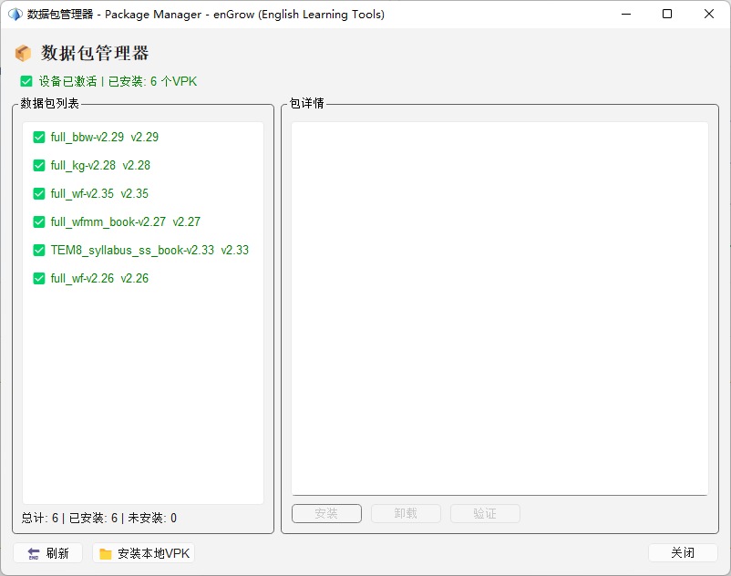
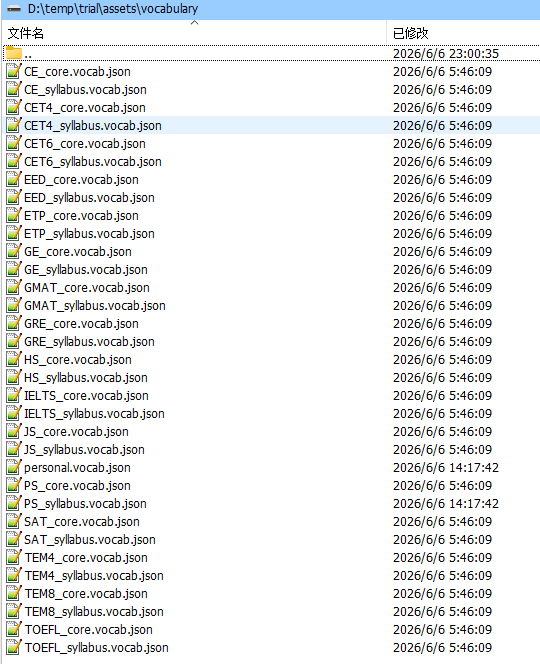

# 数据包管理

## 22.1 什么是数据包（VPK）

enGrow 的扩展内容以**数据包（VPK）**的形式分发和管理：

- 词典数据、知识图谱数据、单词精解内容、构词解析内容等均以 VPK 文件形式交付
- VPK 文件经过加密，与购买者的设备硬件绑定，防止盗用
- 获得数据包文件后，通过数据包管理器导入即可使用

---

## 22.2 打开数据包管理器

点击工具栏的**数据包**图标，或在菜单中选择「数据包管理」。

---

## 22.3 安装数据包

收到开发者发送的 `.vpk` 文件后：

1. 打开数据包管理器
2. 点击「导入数据包」按钮
3. 选择收到的 `.vpk` 文件
4. 软件自动验证并安装（通常 5–30 秒）
5. 安装完成后，对应功能自动解锁

---

## 22.4 已安装数据包列表

数据包管理器显示：

| 列 | 说明 |
|---|---|
| 数据包名称 | 内容类型（词典 / 知识图谱 / 精解 / 构词 / 图书）|
| 版本 | 数据包版本号 |
| 状态 | 已激活 / 已过期 / 验证失败 |
| 内容量 | 如「词典：15,000 词条」|

---

## 22.5 数据包更新

当有更新版本的数据包时：

1. 开发者会提供新版 `.vpk` 文件
2. 直接重新导入新文件即可覆盖旧版本
3. 学习数据（词汇标记、复习记录）不受影响

---

## 22.6 数据包验证失败处理

如果数据包显示「验证失败」：

- 可能原因：在不同设备上使用（VPK 与硬件绑定）
- 解决方法：联系开发者，告知设备型号，申请重新打包

---

## 22.7 备份学习数据

学习数据（词汇标记、复习记录、定制词表等）存储在程序目录下：

- 建议定期备份 `assets/vocabulary/` 文件夹, 该文件夹中存储目标词表和定制词表; 另外， 应用根目录下的global.vocab.json文件是全局的生词和熟词表; 也请酌情定期进行备份. 
- 

