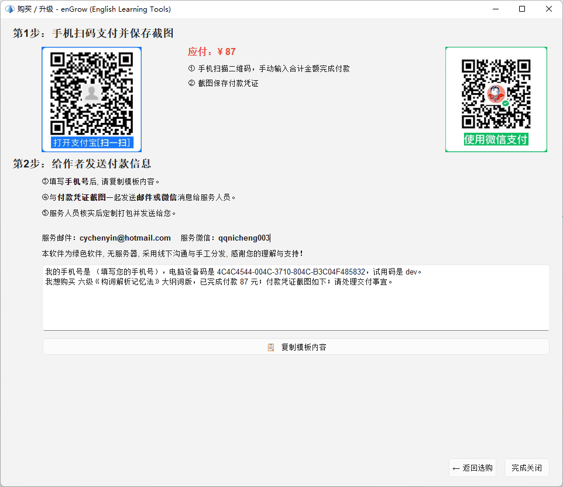

# 购买与解锁功能

## 23.1 购买方式概览

enGrow 采用**人工分发**模式：付款后联系开发者，开发者按您的设备专属打包发货。

| 产品类型 | 说明 |
|---|---|
| **完整正式版 APP** | 包含全部功能，适合深度学习者 |
| **知识图谱数据包（KG）**| 词汇关联网络图谱，单独购买 |
| **单词精解数据包（BBW）**| 每词深度解析内容，单独购买 |
| **构词解析数据包（WF）**| 词根词缀系统数据，单独购买 |
| **配套图书** | 构词解析记忆法等电子图书 |

---

## 23.2 购买流程

```
① 选择想购买的产品
       ↓
② 扫描对应产品的付款二维码，完成付款
       ↓
③ 截图付款凭证
       ↓
④ 将截图发送至开发者微信（见购买对话框）
   备注：产品名称 + 您的设备型号
       ↓
⑤ 开发者核实后，人工打包专属安装包或 VPK 文件
       ↓
⑥ 收到文件后，按照安装说明操作（参见相关章节）
```



---

## 23.3 在应用内发起购买

当您使用的功能需要解锁时，软件会弹出**购买对话框**，您也可以主动打开：

1. 点击工具栏的「购买/解锁」图标
2. 或在各功能面板中点击「解锁」/「立即解锁」链接

购买对话框中包含：
- 产品说明
- 价格信息
- 付款二维码
- 联系开发者方式

---

## 23.4 常见问题

**Q：付款后多久能收到文件？**  
A：通常在工作时间内 2 小时内处理；非工作时间可能延迟至次日。

**Q：数据包可以在多台设备使用吗？**  
A：每次购买绑定一台设备。如需更换设备，请联系开发者，说明情况后可申请转移。

**Q：购买数据包后，正式版 APP 是否需要重新下载？**  
A：不需要。导入数据包（VPK 文件）到现有程序即可，无需重新安装。

**Q：试用版可以购买数据包吗？**  
A：试用版不支持导入数据包，需购买正式版 APP 后才能使用数据包功能。

---

## 23.5 退款政策

由于数字产品的特殊性，数据包一旦发货（文件发送给您）原则上不支持退款。如有质量问题请联系开发者协商解决。
