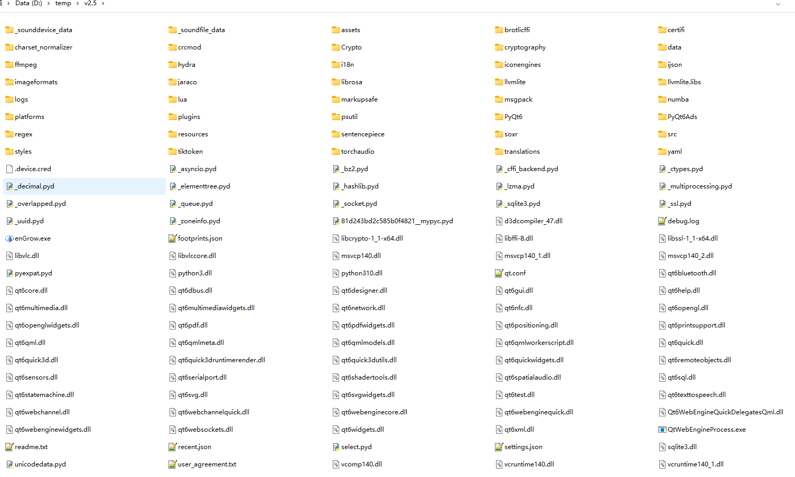
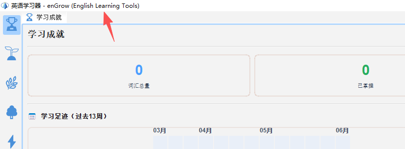

# 下载与安装

## 1.1 下载 

### 试用版下载地址
github release:

enGrow-v2.5.57-trial.zip: https://github.com/cychenyin/enGrow/releases/download/v2.5.57/enGrow-v2.5.57-trial.zip

enGrow-v2.5.57-trial.7z: https://github.com/cychenyin/enGrow/releases/download/v2.5.57/enGrow-v2.5.57-trial.7z

Google Drive: 

enGrow-v2.5.57-trial.zip:  https://drive.google.com/file/d/1qd7igTDshykbsy-0pTM9mg-OPGOlWL4c/view?usp=sharing

enGrow-v2.5.57-trial.7z :  https://drive.google.com/file/d/1xX2gW0SofOTQNqt0KxjHLKNxzt_HJ1mK/view?usp=sharing

百度云盘: 

enGrow-v2.5.57-trial.7z : https://pan.baidu.com/s/1uMk6ym31Qd-MSw9JYiTj0A?pwd=fj49 

enGrow-v2.5.57-trial.zip: https://pan.baidu.com/s/1CvV0KV_wYHBtRpdfFWvt0Q?pwd=22qp 

### 正式版
请先下载试用版, 然后根据提示升级正式版
注意, 正式版仅支持用户购买的电脑上运行, 不允许电脑拷贝.  

## 1.2 系统要求

| 项目 | 最低要求 |
|---|---|
| 操作系统 | Windows 10 64位 及以上 |
| 内存 | 4 GB RAM（推荐 8 GB） |
| 磁盘空间 | 2 GB 可用空间（含词典数据包， 可能需要下载AI预训练模型） |
| 显卡 | 支持 Direct3D 11 或 OpenGL 2.0 |
| 网络 | 激活时需要联网（后续可离线使用） |

如果有 Mac 或者 Linux系统版本使用需求，请单独联系。 

---

## 1.3 安装步骤

本软件不提供安装器，只提供压缩包，请解压缩后运行。 
1. 将收到的安装包解压到任意目录，例如 `D:\enGrow\`
2. 进入解压目录，双击 `enGrow.exe` 启动应用
3. 首次启动时，程序会自动完成初始化（约 5–10 秒）

> ⚠️ **注意**：请勿将程序放置在有中文路径以及路径中带有空格的目录下（如 `D:\我的文档\enGrow\`），可能导致启动失败。

---

## 1.4 试用版限制

试用版软件开箱即用，无需激活，但存在以下限制：

- **有效期**：自首次启动起 7 个自然日，或累计启动 20 次（以先到为准）
- **词汇量**：仅包含基础核心词汇（约 251 词）
- **功能限制**：知识图谱(试用)、单词精解（BBW试用）、构词解析(试用)等高级功能提供有限的体验使用, 完整数据和功能需单独购买解锁

---

## 1.5 正式版激活

正式版为购买者专属版本，与购买者的设备硬件绑定，无需每次联网验证。

**激活条件**：需使用在当前设备上生成的专属安装包（由开发者按订单打包）。

如果您收到的安装包在当前设备上无法正常启动，请联系开发者，提供设备型号及购买凭证。

## 1.6 常见安装问题

| 问题 | 解决方法 |
|---|---|
| 启动时弹出「Windows 已保护你的电脑」| 点击「更多信息」→「仍要运行」 |
| 提示缺少 DLL 文件 | 确保目录完整，不要单独复制 exe |
| 程序启动后立即退出 | 检查路径是否含中文；查看 `logs/` 目录下的日志文件 |
| 试用版提示已过期 | 购买正式版，联系开发者获取专属安装包 |
