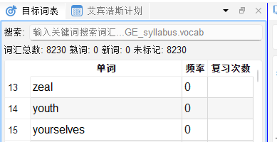

# 目标词表管理

## 9.1 目标词表是什么

**目标词表**是您当前学习目标对应的标准词汇列表，例如高考词汇、四六级词汇、考研词汇等。本软件提供 16种考试的大纲词表和核心词表. 

软件根据目标词表：
- 对视频字幕词汇进行颜色标注（是否在词表内 / 是否已掌握）
- 统计您的词汇掌握进度
- 为艾宾浩斯复习和知识图谱提供词汇范围

---

## 9.2 选择词表

1. 在目标词表面板, 点击右键
2. 选择"切换词表", 展开候选词表列表
3. 选择候选目标词表
4. 该选中会被记录,并在下次重启后依然保持

---

## 9.3 目标词表面板操作

打开「目标词表」面板（`🎯 目标词表`）：


### 词汇状态筛选

面板顶部提供筛选器，可按状态查看词汇：

| 筛选项 | 说明 |
|---|---|
| 全部 | 显示词表所有单词 |
| 生词 | 仅显示标记为未掌握的词 |
| 熟词 | 仅显示标记为已掌握的词 |
| 未标记 | 尚未查阅/标记的词 |

### 快捷键

在目标词表面板中选中单词后：

| 快捷键 | 操作 |
|---|---|
| `N` | 标记为生词（未掌握）|
| `P` | 标记为熟词（已掌握）|
| `Enter` / 单击 | 查词典 |
| `Ctrl+F` | 搜索单词 |

---

## 9.4 进度统计

面板底部或状态栏显示当前词表掌握情况：

```
目标词表：3500 词  |  已掌握：1247 词 (35.6%)  |  待复习：128 词
```



---

## 9.5 拓展词汇学习模式

切换到**拓展词汇量**模式（工具栏 🕸️）时，界面自动调整为：
- 左侧显示目标词表（筛选生词）
- 右侧显示知识图谱（展示该词的关联词汇网络）

通过知识图谱可以发现目标词汇的同根词、派生词、语义近邻词，一次学好一组相关词汇。

[SCREENSHOT: screenshot-09-04 拓展词汇量模式布局，目标词表+知识图谱并排]
