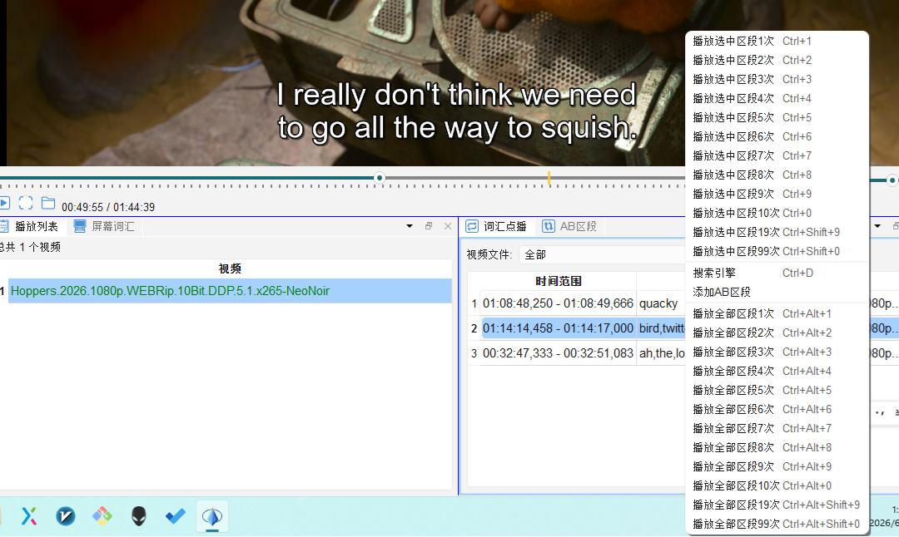

# 词汇点播

## 12.1 功能说明

**词汇点播**（`🔂 词汇点播`）是 enGrow 的特色功能之一。  
它能自动找到视频中包含指定单词的**每一条字幕**，并在这些片段之间**循环播放**，让您在真实语境中反复听到该词，强化语感和记忆。

---

## 12.2 启动词汇点播

### 方法一：从词汇列表跳转

1. 在任意词汇面板（视频词表、字幕词汇、定制词表）中
2. 选中一个或多个单词
3. 按 `Enter` 键 → 自动切换到词汇点播模式并开始播放

### 方法二：直接在词汇点播面板操作

1. 打开「词汇点播」面板（`🔂 词汇点播`）
2. 在搜索框中输入单词
3. 点击「开始点播」

---

## 12.3 面板功能说明

| 控件     | 说明                                                   | 快捷键              |
| ------ | ---------------------------------------------------- | ---------------- |
| 循环播放   | 焦点在词表中播放词汇点播列表中第一个区段                                 | 1-9              |
| 播放选中区段 | 选中的区段循环播放                                            | Ctrl+ 1-9        |
| 播放全部区段 | 不需要选中播放词汇点播列表中                                       | Ctrl + alt + 1-9 |
| 搜索引擎   | 三方网站查询区段的单词                                          | Ctrl + D         |
| 添加AB区段 | 将该点播区段加入到AB区段中, 通常用于点播区段切分不准确, 或者时长过短时, 在AB区段内进行精修调整 |                  |

---

## 12.4 典型使用场景

### 场景一：复习当日生词

看完一集视频后：
1. 切换到「视频词表」面板
2. 按 `Ctrl+A` 全选所有生词
3. 按 `Enter` 进入词汇点播
4. 软件按每个生词在视频中的出现顺序逐一播放，每个词播放 2–3 遍后切换下一词

### 场景二：攻克高频词

在目标词表中找到一个觉得陌生的词：
1. 选中该词 → 按 `Enter`
2. 在词汇点播中观看该词在**所有已播放视频**中的所有出现片段
3. 通过大量真实语境建立感性认识

### 场景三：跟读练习

1. 进入词汇点播，选择包含练习词汇的片段
2. 播放速度调至 0.75×
3. 每播放一遍后，按 `空格` 暂停，跟读字幕内容
4. 按 `R` 重播当前片段，直到跟读流利

---

## 12.5 快捷键

在词汇点播模式下：

| 快捷键 | 操作 |
|---|---|
| `空格` | 播放 / 暂停 |
| `→` | 下一个片段 |
| `←` | 上一个片段 |
| `N` / `P` | 对当前词标记生词/熟词 |
