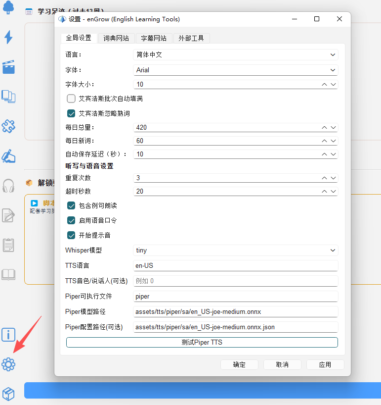

# 设置与个性化

## 21.1 打开设置

- 点击工具栏**设置图标**（⚙️），或
- 按快捷键 `Ctrl+,`

---

## 21.2 常用设置项

### 「词汇」选项卡

| 设置项 | 说明 |
|---|---|
| 目标词表 | 选择当前学习目标（高考/四级/六级/考研/雅思等）|
| 词汇颜色方案 | 调整生词/熟词/未标记词的颜色 |
| 字幕词汇显示 | 是否显示非目标词表中的词汇 |

[SCREENSHOT: screenshot-21-02 设置对话框「词汇」选项卡]

### 「播放器」选项卡

| 设置项 | 说明 |
|---|---|
| 默认播放速度 | 启动时的初始播放速度 |
| 字幕字体大小 | 视频字幕显示大小 |
| AB 循环默认延伸时间 | 片段前后扩展的秒数 |
| 字幕语言优先级 | 多语言字幕时优先显示的语言 |

### 「发音」选项卡

| 设置项 | 说明 |
|---|---|
| 发音引擎 | 选择 TTS 引擎（系统 TTS / 在线 TTS）|
| 英式/美式发音 | 词典发音按钮默认使用的口音 |
| 发音速度 | TTS 朗读速度 |

### 「界面」选项卡

| 设置项 | 说明 |
|---|---|
| 语言 | 软件界面语言（中文 / English / 日本語 / Deutsch）|
| 主题 | 深色模式 / 浅色模式 |
| 字体 | 界面字体大小 |

---

## 21.3 重置设置

如果设置调乱了，可以恢复默认：

1. 在设置对话框底部点击「恢复默认」
2. 确认后所有设置恢复为出厂默认值
3. **注意**：此操作不会清除您的词汇学习数据
